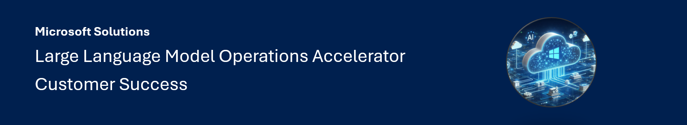

# Azure LLMOps Solution Accelerator

Welcome to the LLMOps Solution Accelerator! This project provides a ready-to-run LLMOps solution, with a primary focus on CI/CD pipeline implementation. It includes essential concepts designed to help you seamlessly adopt LLMOps practices into your projects.

## Highlights

- Bootstrap your project in under an hour
- Provision resources with Infrastructure as Code
- Easy-to-configure and extend templates
- Leverage Azure AI Studio

## Documentation

Explore this set of articles to navigate and implement the accelerator smoothly. These resources clarify the repository structure, Git workflow, and reference architecture, providing a strong foundation for successful execution.

1. [Repository Structure](documentation/repository_structure.md): Describes how the repository structure is organized.
2. [Git Workflow and Pipelines](documentation/git_workflow.md): Explains the Git workflow and CI/CD pipelines used in the accelerator.
3. [Reference Architecture](documentation/reference_architecture.md): Reference architecture that this accelerator is based on.
1. [RAG Project Template](https://github.com/azure/llmops-project-template): Offers a ready-to-use RAG project template.
1. [LLM Project Roles](documentation/project_roles.md): Details the various roles in an LLM project and their responsibilities.

## How-to

1. [Bootstrapping a new Project](documentation/bootstrapping.md)
2. [Delivering a new Feature](documentation/delivering_new_feature.md)

## Contributing

This project welcomes contributions and suggestions.  Most contributions require you to agree to a
Contributor License Agreement (CLA) declaring that you have the right to, and actually do, grant us
the rights to use your contribution. For details, visit https://cla.opensource.microsoft.com.

When you submit a pull request, a CLA bot will automatically determine whether you need to provide
a CLA and decorate the PR appropriately (e.g., status check, comment). Simply follow the instructions
provided by the bot. You will only need to do this once across all repos using our CLA.

This project has adopted the [Microsoft Open Source Code of Conduct](https://opensource.microsoft.com/codeofconduct/).
For more information see the [Code of Conduct FAQ](https://opensource.microsoft.com/codeofconduct/faq/) or
contact [opencode@microsoft.com](mailto:opencode@microsoft.com) with any additional questions or comments.

## Trademarks

This project may contain trademarks or logos for projects, products, or services. Authorized use of Microsoft 
trademarks or logos is subject to and must follow 
[Microsoft's Trademark & Brand Guidelines](https://www.microsoft.com/en-us/legal/intellectualproperty/trademarks/usage/general).
Use of Microsoft trademarks or logos in modified versions of this project must not cause confusion or imply Microsoft sponsorship.
Any use of third-party trademarks or logos are subject to those third-party's policies.
