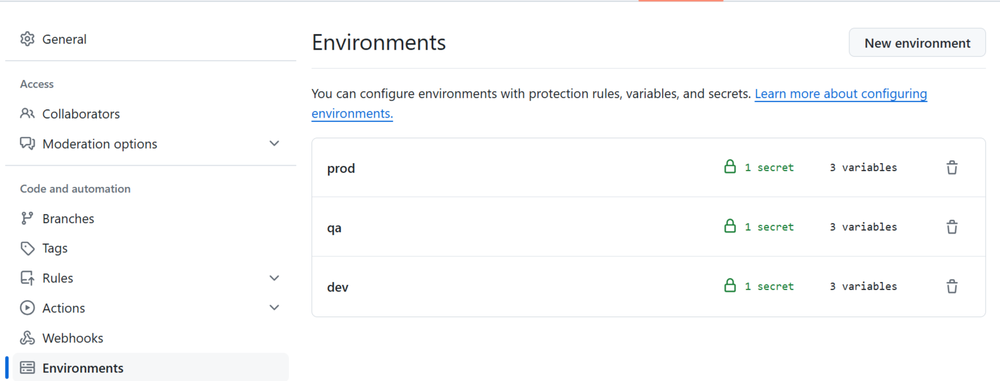
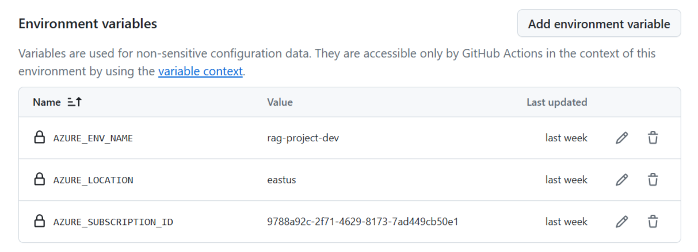

# Bootstrapping a New Project

In this section, you will learn how to bootstrap a new project based on a project template.

## Prerequisites

- An Azure Subscription with access to the [Azure OpenAI Service](https://aka.ms/oai/access).
- Permissions to create a Service Principal (SP) in Azure AD.
- Permissions to assign the Owner role to the SP within the subscription.
- A GitHub Account.

## Steps to Bootstrap a Project

1. **Clone the LLMOps Repo**

   Clone the repository from GitHub:

   ```sh
   git clone https://github.com/azure/llmops
   ```

2. **Fill the `bootstrap.properties` File**

   Open the `bootstrap.properties` file and add the required properties.

   Below is a brief description of the properties you need to include:

   - **GitHub Repo Creation Properties**
     - `github_username`: Your GitHub username.
     - `github_use_ssh`: Set to `true` to use SSH, `false` to use HTTPS.
     - `github_template_repo`: The template repository to clone (ex: "azure/llmops-project-template").
     - `github_new_repo`: The new repository to create (ex: "placerda/my-llmops-project").
     - `github_new_repo_visibility`: Visibility of the new repository (`public`, `private`, `internal`).
     - `github_default_branch`: The default branch name for the new repository.

   - **Dev Environment Provision Properties**
     - `azd_dev_env_provision`: Set to `true` to provision a development environment.
     - `azd_dev_env_name`: The name of the development environment (ex: "rag-project-dev").
     - `azd_dev_env_subscription`: Your Azure subscription ID.
     - `azd_dev_env_location`: The Azure region for your dev environment (ex: "eastus").

3. **Authenticate with Azure and GitHub**

   Log in to Azure:

   ```sh
   azd auth login
   ```

   Log in to GitHub:

   ```sh
   gh auth login
   ```

4. **Run the Bootstrap Script**

   The bootstrap script is available in two versions: Bash (`bootstrap.sh`) and PowerShell (`bootstrap.ps1`). 

    Run the appropriate script for your environment.

   **For Bash:**

   ```sh
   ./bootstrap.sh
   ```

   **For PowerShell:**

   ```powershell
   .\bootstrap.ps1
   ```

   > Note: The script will create and initialize the new repository. It checks if the new repository exists, creates it if it does not, clones the template repository, and mirrors it to the new repository. It also sets the default branch for the new repository. After creating the repository, it will provision the development environment resources if you set `azd_dev_env_provision` to true.

5. **Create a Service Principal**

   Create a service principal using the following command:

   ```sh
   az ad sp create-for-rbac --name "<your-service-principal-name>" --role Owner --scopes /subscriptions/<your-subscription-id> --sdk-auth
   ```

    Please ensure that the output information created here is properly save for future use.


6. **Set GitHub Environment Variables**

   Go to the newly created project repository and set the following GitHub environment variables and secret for three environments: `dev`, `qa`, and `prod`.

   - **Environment Variables:**
     - `AZURE_ENV_NAME`
     - `AZURE_LOCATION`
     - `AZURE_SUBSCRIPTION_ID`
   
   - **Secret:**
     - `AZURE_CREDENTIALS`

   After creating the variables and secret, your Environments page should resemble the following example:
   
   
   
   Below is an example of environment variable values for a development environment:
   
   
   
   The `AZURE_CREDENTIALS` secret should be formatted as follows:
    
    ```
    {
        "clientId": "your-client-id",
        "clientSecret": "your-client-secret",
        "subscriptionId": "your-subscription-id",
        "tenantId": "your-tenant-id"
    }
    ```

That's all! Your new project is now bootstrapped and ready to go.