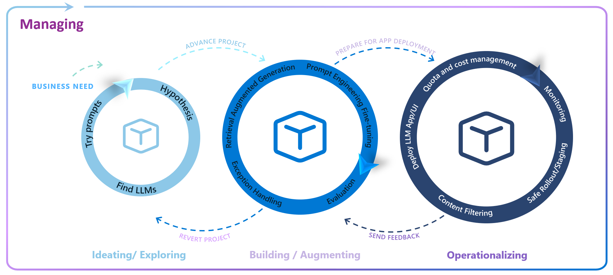

# Concepts and Structure

The LLMOps Solution Accelerator is a flexible framework designed to kick-start generative AI projects that utilize large language models (LLMs). It is not a standalone product but a set of guidelines and patterns that can be adapted to the tools and processes your organization uses.

## Concepts

### Enterprise LLM Lifecycle

The LLMOps solution accelerator supports the four Enterprise LLM Lifecycle loops.

- **Ideating & Exploring**: Select LLMs based on business needs, conduct experiments with data and prompts, and validate hypotheses using vector indexing and bulk testing.

- **Building & Augmenting**: Enhance chosen LLMs with Retrieval Augmented Generation (RAG) and fine-tuning to meet specific requirements. Continuous evaluation ensures model safety and relevance.

- **Operationalizing**: Transition LLMs to production with deployment, monitoring, content safety systems, and CI/CD integration. Azure AI supports experimentation, deployment, and monitoring.

- **Managing**: Implement governance, security, and compliance frameworks using Azure AI's built-in capabilities. Set security policies, integrate with Microsoft Purview for compliance, and ensure responsible AI practices.

More information on the LLM Lifecycle on [Building for the future: The enterprise generative AI application lifecycle with Azure AI](https://azure.microsoft.com/en-us/blog/building-for-the-future-the-enterprise-generative-ai-application-lifecycle-with-azure-ai/)

## Repository Structure

## Defining a New LLM Project
