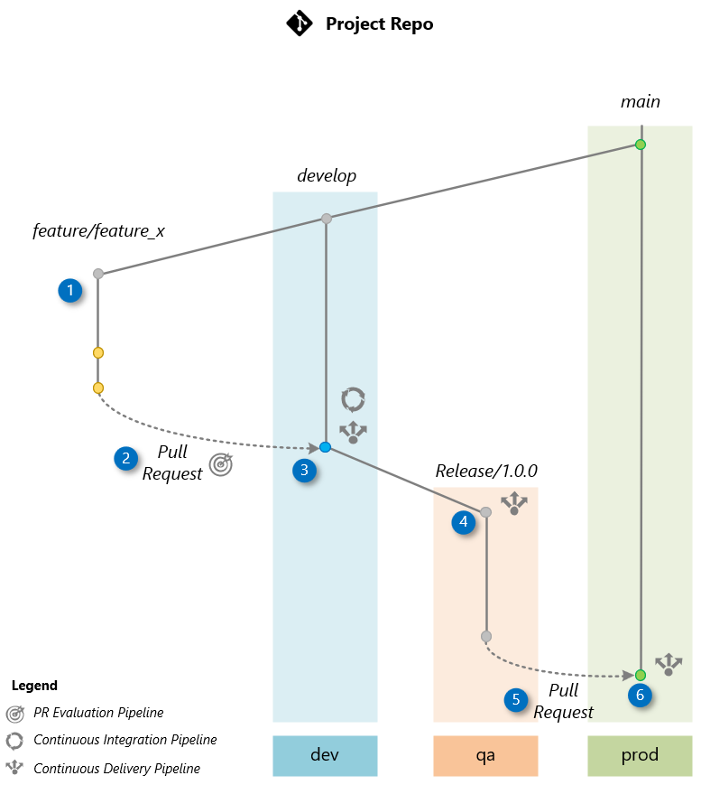

# Delivering a New Feature

Once the project bootstrapping is complete, the team can begin developing new features. This section provides a detailed guide on delivering a new feature, covering every step from initial development to production deployment. To illustrate the procedure, we will develop a new feature called "Feature X," which will be included in the project's release 1.0.0. The process can be summarized in six steps, represented in the following diagram, making it easier to understand and follow along.



Follow the steps below to deliver this feature from the beginning of development to deployment in production. You will need access to your project repository that has been bootstrapped, a terminal (bash or PowerShell) with Git, and the GitHub page of your repository.

### Start Cloning Your Project

We will use an example project bootstrapped in the **placerda/rag-project** GitHub repository, based on the [llmops-project-template](https://github.com/azure/llmops-project-template). The same process applies to your bootstrapped project repository. For detailed instructions on bootstrapping a project, refer to the [Bootstrapping a New Project](bootstrapping.md) page. Use a command like the one below to clone your bootstrapped project:

```bash
git clone git@github.com:placerda/rag-project.git
cd rag-project
```

### 1. Creating a Feature Branch

The workflow starts by creating a feature branch named `feature/feature_x` from the `develop` branch. This is where the development team will work on the new feature X.

**Switch to the `develop` branch and pull the latest changes:**

```bash
git checkout develop
git pull
```

**Create the feature branch:**

```bash
git checkout -b feature/feature_x
```

**Make non-disruptive changes to the repository. For instance, create a file `FEATUREX.md` in the project root:**

*Using Bash:*

```bash
touch FEATUREX.md
```

*Using PowerShell:*

```powershell
New-Item -ItemType File -Name "FEATUREX.md"
```

This ensures the new feature is developed in isolation, maintaining the integrity of the project's `develop` branch and promptflow.

### 2. Pull Request (PR) to `develop`

Upon completing the feature, create a Pull Request (PR) to merge changes from the feature branch `feature/feature_x` to the `develop` branch, which is the default branch where the team integrates changes.

**Add changes, commit, and push to the feature branch:**

```bash
git add .
git commit -m "Feature X complete"
git push origin feature/feature_x
```

**Create the PR:**

```bash
gh pr create --base develop --head feature/feature_x --title "Feature X" --body "Description of the changes and the impact."
```

You can also use the GitHub website to create the pull request. Remember to select `develop` as the base branch and `feature/feature_x` as the compare branch.

The creation of the PR triggers a PR Evaluation Pipeline to ensure that the code adheres to standards, passes unit tests, and the orchestration flow is evaluated by AI to ensure it meets quality metrics.

### 3. Merge to `develop`

Approve the Pull Request, merging it into the `develop` branch. This merge triggers the Continuous Integration (CI) Pipeline, which builds the orchestration flow and conducts AI-assisted evaluations using a comprehensive test dataset based on the [Golden Dataset](https://aka.ms/copilot-golden-dataset-guide). Upon successful completion, the Continuous Deployment (CD) Pipeline is executed to deploy the flow to the **dev** environment.

**Merge the PR using GitHub:**

Go to the Pull Requests tab in your repository, select the recently created PR, and click on **Merge pull request**.

### 4. Release Branch (`release/1.0.0`)

After confirming the stability of the `develop` branch through testing in **dev**, create a release branch `release/1.0.0` from `develop`. This triggers a *Continuous Deployment (CD) pipeline* to deploy the application to the **qa** environment. Before deployment, an AI-based evaluation assesses [quality](https://learn.microsoft.com/en-us/azure/ai-studio/how-to/develop/flow-evaluate-sdk), risk and [safety](https://learn.microsoft.com/en-us/azure/ai-studio/how-to/develop/simulator-interaction-data) evaluation. The application in **qa** is then used for User Acceptance Testing (UAT) and [red-teaming](https://learn.microsoft.com/en-us/azure/ai-services/openai/concepts/red-teaming) ou LLM App.

**Create the release branch:**

```bash
git checkout develop
git pull origin develop
git checkout -b release/1.0.0
git push origin release/1.0.0
```

### 5. Pull Request to `main`

After UAT tests in the **qa** environment confirm that the application is ready for production, create a Pull Request (PR) to merge the changes into the `main` branch from the `release/1.0.0` branch.

**Create the PR:**

Below is an example utilizing the GitHub CLI:

```bash
gh pr create --base main --head release/1.0.0 --title "Release 1.0.0" --body "Merging release/1.0.0 into main after successful UAT in QA environment"
```

You can also use the GitHub website to create the pull request. Remember to select `main` as the base branch and `release/1.0.0` as the compare branch.

### 6. Merge to `main`

Once the Pull Request (PR) to the `main` branch is approved on GitHub, go to the Pull Requests tab of your project repository on GitHub, select the PR created for merging into production, and click on **Merge pull request** to manually approve the merge of `release/1.0.0` into the `main` branch. This action triggers the Continuous Deployment (CD) pipeline, which deploys the code to the **prod** environment.