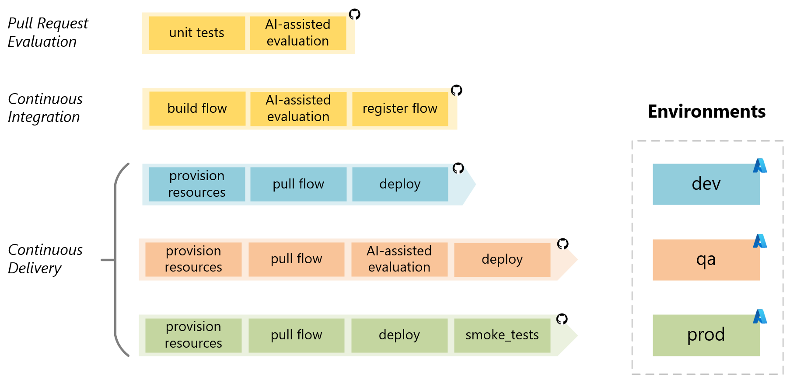

# Git Workflow and Pipelines

<<<<<<< HEAD
On this page, you will learn about the Git workflow used by this accelerator, including branches and how changes to the code can trigger automation pipelines.This workflow follows the [Git flow](https://nvie.com/posts/a-successful-git-branching-model) methodology, which is a best practice for managing Git with multiple environments like **dev**, **qa**, and **prod**. But you can always choose the workflow that works best for your project.
=======
On this page, you will learn about the Git workflow used by this accelerator, including branches and how changes to the code can trigger automation pipelines. The workflow follows the [Git flow](https://nvie.com/posts/a-successful-git-branching-model) methodology, which is widely recognized for effectively managing Git with multiple environments like **dev**, **qa**, and **prod**. However, feel free to choose the workflow that best suits your project's needs.
>>>>>>> origin/main

# Git Workflow

The image below represents the workflow used in the project repository. Let's see how the delivery of a new feature works based on this workflow. In this example, we are developing a new feature called "Feature X," which will be delivered in the project's release 1.0.0.


Here's a detailed description of the workflow:

1. **Feature Branch**

The workflow begins when the development team creates a feature branch named `feature/feature_x` from the `develop` branch. This branch is where developers work on developing the new feature X.

```bash
git checkout develop
git pull
git checkout -b feature/feature_x
```

2. **Pull Request (PR)**:

Upon completing the feature, a Pull Request (PR) is initiated from the feature branch `feature/feature_x`  to the `develop` branch, which is the default branch where the team integrates changes.

The creation of the PR triggers a *PR Evaluation Pipeline* to ensure that the code adheres to standards, passes unit tests, and the orchestration flow is evaluated by AI to ensure it meets quality metrics.

```bash
git add .
git commit -m "Feature complete: [Your Feature Description]"
git push origin feature/feature_x
# Use GitHub CLI or the GitHub website to create PR.
gh pr create --base develop --head feature/feature_x --title "[Your Feature Name]" --body "Description of the changes and the impact."
```

3. **Merge to develop**:

<<<<<<< HEAD
Once the Pull Request is approved, it is merged into the `develop` branch. This merge triggers the *Continuous Integration (CI) Pipeline*, which builds the orchestration flow and conducts AI-assisted evaluations using a comprehensive test dataset based on the [Golden Dataset](https://aka.ms/copilot-golden-dataset-guide). Upon successful completion, the *Continuous Delivery (CD) Pipeline* is executed to deploy the flow to the **dev** environment.

4. **Release Branch (Release/1.0.0)**:

After confirming the stability of the `develop` branch through testing in **dev**, a release branch `release/1.0.0` is created from `develop`. This triggers a *Continuous Delivery (CD) pipeline* to deploy the application to the **qa** environment. Before deployment, an AI-based evaluation assesses quality, risk, and safety metrics to ensure stability. The application in **qa** is then used for User Acceptance Testing (UAT) and [red teaming](https://learn.microsoft.com/en-us/azure/ai-services/openai/concepts/red-teaming) testing.
=======
Once the Pull Request is approved, it is merged into the `develop` branch. This merge triggers the *Continuous Integration (CI) Pipeline*, which builds the orchestration flow and conducts AI-assisted evaluations using a comprehensive test dataset based on the [Golden Dataset](https://aka.ms/copilot-golden-dataset-guide). Upon successful completion, the *Continuous Deployment (CD) Pipeline* is executed to deploy the flow to the **dev** environment.

4. **Release Branch (Release/1.0.0)**:

After confirming the stability of the `develop` branch through testing in **dev**, a release branch `release/1.0.0` is created from `develop`. This triggers a *Continuous Deployment (CD) pipeline* to deploy the application to the **qa** environment. Before deployment, an AI-based evaluation assesses [quality](https://learn.microsoft.com/en-us/azure/ai-studio/how-to/develop/flow-evaluate-sdk), risk and [safety](https://learn.microsoft.com/en-us/azure/ai-studio/how-to/develop/simulator-interaction-data) evaluation. The application in **qa** is then used for User Acceptance Testing (UAT) and [red-teaming](https://learn.microsoft.com/en-us/azure/ai-services/openai/concepts/red-teaming) ou LLM App.
>>>>>>> origin/main

```bash
git checkout develop
git pull origin develop
git checkout -b release/1.0.0
git push origin release/1.0.0
```

5. **Pull Request to main**:

After UAT tests in the **qa** environment confirm that the application is ready for production, a Pull Request (PR) is created to merge the changes into the `main` branch.

```bash
# Use GitHub CLI or the GitHub website to create PR.
gh pr create --base main --head release/1.0.0 --title "Release 1.0.0" --body "Merging release/1.0.0 into main after successful UAT in QA environment" 
```

6. **Merge to main**:

<<<<<<< HEAD
Once the pull request (PR) to the `main` branch is manually approved, the release branch is merged into the `main` branch. This action triggers the Continuous Delivery (CD) pipeline, which deploys the code to the **prod** environment.

## CI/CD Pipelines

CI/CD (Continuous Integration/Continuous Delivery) pipelines automate integration, evaluation, and deployment, streamlining workflows, reducing errors, and ensuring efficient delivery of high-quality application to production.



The *Pull Request pipeline* runs unit tests and utilize AI-assisted evaluation to validate the changes in the pull request. This step ensures that any new code additions or modifications meet the project's quality standards before being integrated into the main codebase.

In the *Continuous Integration pipeline*, the process starts with the build flow, where the application is built from the source code. Following this, an AI-assisted evaluation is conducted to analyze the build for potential issues. If the evaluation is successful, the final step is the register flow, which registers the built application and prepares it for deployment.

The *Continuous Delivery pipeline* has three different configurations one for each environment: **dev**, **qa**, and **prod**. In the *dev* option, necessary resources are set up, the latest code is pulled, and the application is deployed to the **dev** environment for initial testing. The *qa* alternative provisions resources, retrieves the latest code, and performs an AI-assisted evaluation to ensure the application meets quality standards before deployment to the **qa** environment. Finally, the *prod* option deploys the application to the **prod** environment after provisioning resources and updating the code. Smoke tests confirm the application's functionality post-deployment.
=======
Once the pull request (PR) to the `main` branch is manually approved, the release branch is merged into the `main` branch. This action triggers the Continuous Deployment (CD) pipeline, which deploys the code to the **prod** environment.

## CI/CD Pipelines

The CI/CD (Continuous Integration/Continuous Deployment) pipelines automate integration, evaluation, and deployment processes, ensuring efficient delivery of high-quality applications.


**The Pull Request Evaluation Pipeline** begins with unit tests, followed by a code review, and concludes with AI-assisted prompt evaluation to validate code changes before integration.

**In the Continuous Integration Pipeline**, the process starts with unit tests and code reviews, followed by AI-assisted flow evaluation to identify potential issues. The application is then built, and the flow image is registered for deployment.

**The Continuous Deployment Pipeline** operates across three environments: dev, qa, and prod. Provisioning of resources is performed when necessary, and the deployment of the application is executed in the respective environment.

- **In the dev environment**, the latest code is pulled, and the application is deployed for the development team's testing.

- **In the qa environment**, the code is retrieved, and AI-assisted evaluations for quality and safety are conducted, followed by integration testing. The application is then deployed and made available for User Acceptance Testing (UAT).

- **In the prod environment**, the same image built in the Continuous Integration Pipeline is deployed, ensuring consistency and reliability. Integration testing is conducted, and smoke testing ensures functionality post-deployment.

This structured approach streamlines workflows, reduces errors, and guarantees the efficient delivery of applications to production.
>>>>>>> origin/main
