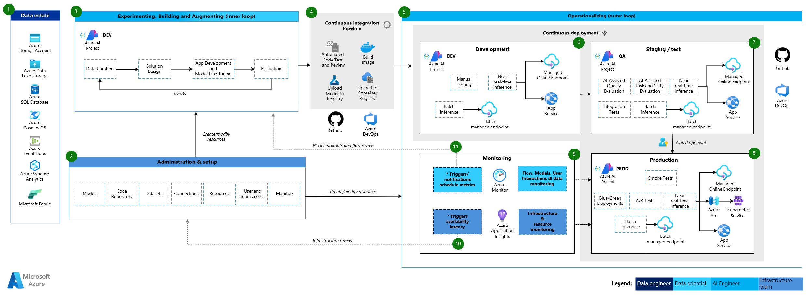

# Reference Architecture

<<<<<<< HEAD
In this section, we present the reference architecture LLMOps used by this accelerator.
=======
This section details the reference architecture for LLMOps used by this accelerator. The architecture serves as a guideline, offering a comprehensive framework adaptable to the specific needs and requirements of each project.

>>>>>>> origin/main
