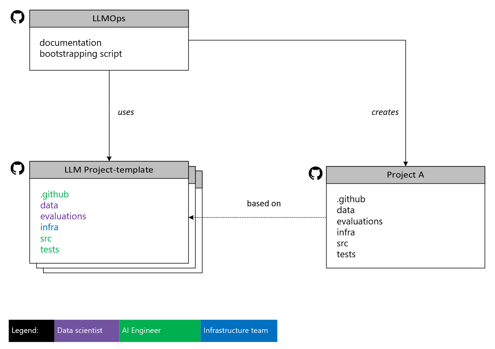

# Repository Structure and Roles

This accelerator utilizes project templates as its foundation. Therefore, we've structured our repository system to include a primary repository, which contains comprehensive documentation, and bootstrapping scripts for initiating projects using these templates. To maintain simplicity and promote cohesion within each repository, we allocate a separate repository for each project template. The diagram below illustrates the proposed structure.

## Repositories and their Directories

This section describes the directory structure used in the LLMOps accelerator. By following this directory structure, teams can ensure a consistent and organized approach to developing and managing their LLM projects.

### LLMOps

The `LLMOps` repository is the central hub, offering detailed documentation and scripts for initializing projects with these templates. It allows direct use or customization through copying/forking. It includes the following:

- **documentation**: Holds setup guides and concept explanations for the LLMOps accelerator.
- **bootstrapping script**: Initializes and configures new projects using LLMOps templates.

### LLM Project-template

The `LLM Project-template` represents repositories serving as templates for LLM projects, which can be utilized to initiate new projects. While the structure of project templates may differ based on specific needs, a typical template includes the following subdirectories:

- **.github**: GitHub-specific workflows, and actions used for continuous integration and deployment.
- **data**: This directory is used to store datasets required for training and evaluation.
- **evaluations**: Contains scripts and resources for evaluating the performance of the trained models.
- **infra**: Holds infrastructure-related code and configurations, such as Bicep or Terraform scripts.
- **src**: Source code for the project, including orchestration flows, model definitions, training scripts, and utilities.
- **tests**: Contains test cases and scripts to ensure the quality and correctness of the codebase.

### Project A

`Project A` illustrates an example of a project repository that can be instantiated from one of the `LLM Project-template` repositories. It adheres to the same directory structure as the template.

## LLM Project Roles

This section outlines the key roles within an LLM project and what each is responsible for.

### AI Engineer

- **Leading Development**: Guides the project's development, making sure everything runs smoothly.
- **Building the App**: Works on coding and putting together different parts of the application.
- **Creating Prompts**: Designs the prompts the application uses, ensuring they're effective and meet project needs.
- **Managing Data**: Organizes, chunk and labels data, sets up custom indexes.
- **Overseeing Data Flow**: Manages data flow systems for seamless integration.
- **Production Readiness**: Guarantees the solution is reliable and deployment-ready.

### Data Scientist

- **Improving Search**: Enhances retrieval efficiency and accuracy.
- **Working on Prompts with AI Engineers**: Helps fine-tune the prompts with AI Engineers.
- **Tuning the Models**: If needed, adjusts models to improve how they perform and the results they give.

### Infrastructure Team

- **Setting Up Resources**: Manages technical resources for project setup.
- **Handling Access**: Manages access rights, ensuring security and project accessibility.